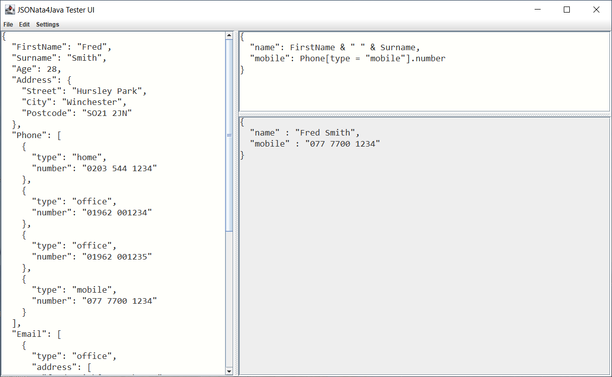

# JSONata4Java #
This project provides an Open Source Java version of the JSONata project from https://jsonata.org

JSONata was created by Andrew Coleman to provide many of the features that XPath and XQuery provide for XML, except these capabilities apply to JSON-structured data. The JavaScript implementation is described at the following websites&colon;

* [JSONata main site](http://jsonata.org/)
* [Try JSONata -- experiment with commands](http://try.jsonata.org/)
* [JSONata Documentation](http://docs.jsonata.org/overview.html)
* [JavaScript JSONata github repository](https://github.com/jsonata-js/jsonata)

JSONata4Java is an attempt to port the jsonata.js 1.8.4 capabilities to Java 1.8. 
The easiest way to use this library is to include it as a dependency in your Maven pom.xml using these line&colon;
```
<dependency>
  <groupId>com.ibm.jsonata4java</groupId>
  <artifactId>JSONata4Java</artifactId>
  <version>2.4.7</version>
</dependency>
```

You can also opt to clone this repository using the command line below and build the jars yourself&colon;
```
git clone https://github.com/IBM/JSONata4Java.git
```

### Differences with JavaScript jsonata.org ###

The Java version uses ANTLR to build the parser for the language, and Java Objects are more tightly controlled that JavaScript Objects. Therefore, some things differ between the Java implementation and JavaScript implementation. For example:
 - we require functions to be called with their arguments, even if no arguments are being passed. This is because we differentiate a variable reference with no parentheses from a function that has parentheses. 
 - we require variables to begin with a letter or an underscore (but not a number) whereas jsonata.org allows variables to begin with numbers ([Issue 267](https://github.com/IBM/JSONata4Java/issues/267)).
 - Arrays hold JsonNode types so cannot hold references to functions, whereas jsonata.org can manage function references within an array ([Issue 268](https://github.com/IBM/JSONata4Java/issues/268)).  

### Java 11 and 1.8 Versions needed for new Antlr 4.13.1 (Also updated project file to Eclipse 2023-12)

The code was created using IBM Semeru Runtime Open Edition 11.0.17.0 (build 11.0.17+8). You can import the project into Eclipse 2023-03 or newer. This is to allow the newer version of ANTLR to generate necessary code from the g4 file defining the language.  You can download the Java JDK 11 from https://developer.ibm.com/languages/java/semeru-runtimes/downloads/?license=IBM 

** *However, the build dependencies are set to allow use with Java 1.8* **


### Building the jar files

To build the code, 
you'll want to right click on the project and select Maven / Update Project to ensure the dependencies are available, then 
you can right click on the pom.xml file and select **Run as... / Maven build...** then fill in clean install as the goals&colon;
**clean install** as shown below&colon;


Alternatively, you can run from the command line in the JSONata4Java directory&colon;  
`mvn clean install -Dgpg.skip`

Note: to build and deploy the jars to Maven Central you need to use a command like&colon;  
`mvn clean install deploy -Prelease`

Once you have run the launcher, you can find the jar files in the /target directory. There are two&colon;
* **JSONata4Java-2.4.7-jar-with-dependencies.jar** (thinks includes dependent jar files)
* **JSONata4Java-2.4.7.jar** (only the JSONata4Java code)

The com.api.jsonata4java.Tester program enables you to enter an expression and run it 
against the same JSON as is used at the https://try.jsonata.org site. You can also 
provide a fully qualified filename of a JSON file on the command line to test expressions 
against your own data.

There is a tester.sh you can run in the project to enable you to test expressions 
against the same JSON as is used at the https://try.jsonata.org site.


### Fixes ###
Issue 167 to add Synced suffixed evaluation methods to allow people running 
in a multi-threaded environment to use evaluateSynced, etc. The non-Synced 
methods are not thread-safe.

Issue 260 to add support for timeoutMS and maxDepth to the evaluate methods in Expression.

### New Feature for Version 2.4.7 ###
A new function for $fromMillisZoned has been added to allow passing a Timezone string as the 3rd parameter.

### New Feature for Version 2.4 ###
We support now a simple version of JSONata's Order-by operator (see https://docs.jsonata.org/path-operators#---order-by).

### New Features for Version 2 ###
Many thanks to **Martin Bluemel** for adding these new features&colon;  

**Improved Chaining**&colon;
JSONata4Java basically does support function chaining now. However, it does not yet 
support the "function name only" syntax for function chaining (the one without parentheses). 
So we recommend using a syntax like below&colon;

```
$map(Customer, function($v, $i, $a) { $v ~> $uppercase() ~> $trim() } )
```
rather than  
```
$map(Customer, function($v, $i, $a) { $v ~> $uppercase ~> $trim } )
```
for the JSON%&colon;
```
{
  "Customer": [
    "    paul   ",
    "  berverly     "
  ]
}
```

**Parent Operator (%)**&colon;  
JSONata4Java now supports the parent (%) operator. This allows 
references to parents in the path. See [jsonata docs for % Parent Operator](https://docs.jsonata.org/path-operators#-parent) 
for details.

**Tester UI**&colon;  
In addition to the command line based tester we provide also a JSONata Tester UI app based on Java Swing.
Start the app by running class `com.api.jsonata4java.testerui.TesterUI` from the IDE of your choice
or use the start wrapper script testerui.sh (or testerui.cmd on Windows).

Basically it works quite similar to the JSONata Exerciser. This way you can test any JSONata mapping interactively
against JSONata4Java.




**Regular Expressions**&colon;

Since version 2.0.0 we support regular expression arguments of the form `/<regular expression pattern>/` for functions&colon;  
- $contains()
- $replace()
- $split()
- $match()

There are only few differences to regular expressions in original JSONata due to the fact
that in JSONata4Java we use different parser technology and we use the original Java regular expression implementation.

- we do not support regular expressions patterns containing any white space character.  
  Please use escaped forms&colon; **\s \t \n** instead. This will be compatible to original JSONata.

- in function $replace() the behavior of capturing group replacements differs slightly from original JSONata&colon;
    - we support more than 9 capturing groups.
    - like original JSONata we support escaping $ with $$ in the replacement text but
      if you want to have a $ at the end of your replacement string you have to escape it explicitly in JSONata4Java&colon;  For 
        example&colon;  
      Original JSONata evaluates `$replace("abcdefghijklmno", /(ijk)/, "$x$")` to `"abcdefgh$x$lmno"`  
      In JSONata4Java you should write `$replace("abcdefghijklmno", /(ijk)/, "$x$$")` to `"abcdefgh$x$lmno"`
      in order to achieve the same - which is compatible to original JSONata anyway. 
  k
**Please note&colon;** that in JSONata4Java <= 1.7.9 we already provided (non documented) regular expressions support for functions&colon;
- $replace()
- $split()
- $match()
  
when using a pattern argument written in form `"<pattern>"` or `'<pattern>'` containing a regular expression.
Since version 2.0.0 you have to convert such arguments into syntax `/<pattern>/`.  For 
example&colon;  
`$replace("foo bar", "fo.*ar", "Foo Bar")`  
would have to be converted into  
`$replace("foo bar", /fo.*ar/, "Foo Bar")` in order to provide the same result.  

### Using JSONata4Java APIs ###
The API's to embed JSONata execution in your code are simple. The code below is copied from the Test utility, and uses the 
jackson core ObjectMapper to parse a JSON formatted String into a JsonNode object. The dependency for the 
jackson core is below\&colon;

``` 
<dependency>
   <groupId>com.fasterxml.jackson.core</groupId>
   <artifactId>jackson-databind</artifactId>
   <version>2.9.8</version>
</dependency>
```

Here is example code to parse and execute an expression against an object (jsonObj) created from 
a JSON String.

```
package com.api.jsonata4java;

import java.io.IOException;

import com.api.jsonata4java.expressions.EvaluateException;
import com.api.jsonata4java.expressions.EvaluateRuntimeException;
import com.api.jsonata4java.expressions.Expressions;
import com.api.jsonata4java.expressions.ParseException;
import com.fasterxml.jackson.core.JsonProcessingException;
import com.fasterxml.jackson.databind.JsonNode;
import com.fasterxml.jackson.databind.ObjectMapper;

public class Test {

   public static void main(String[\] args) {
      Expressions expr = null;
      ObjectMapper mapper = new ObjectMapper();
      JsonNode jsonObj = null;
      String json = "{ \"a\":1, \"b\":2, \"c\":[1,2,3,4,5] }";
      String expression = "$sum(c)";
      try {
         jsonObj = mapper.readTree(json);
      } catch (IOException e1) {
         e1.printStackTrace();
      }

      try {
         System.out.println("Using JSON:\n" + mapper.writerWithDefaultPrettyPrinter().writeValueAsString(jsonObj));
         System.out.println("expression=" + expression);
         expr = Expressions.parse(expression);
      } catch (ParseException e) {
         System.err.println(e.getLocalizedMessage());
      } catch (EvaluateRuntimeException ere) {
         System.out.println(ere.getLocalizedMessage());
      } catch (JsonProcessingException e) {
         e.printStackTrace();
      }
      try {
         System.out.println("evaluate returns:");
         JsonNode result = expr.evaluate(jsonObj);
         if (result == null) {
            System.out.println("** no match **");
         } else {
            System.out.println("" + mapper.writerWithDefaultPrettyPrinter().writeValueAsString(result));
         }
      } catch (EvaluateException | JsonProcessingException e) {
         System.err.println(e.getLocalizedMessage());
      }
   }
}

```

The expression is text describing access to, and manipulation of JSON-structured data. 
In this case we are getting the value of the "c" variable and summing up its array values.
JSONata is very powerful, allowing many built in functions as described at the http://docs.jsonata.org/overview.html site.
 
We begin by parsing the expression to ensure there are no syntax errors. 
If the content parses correctly, you can then execute the parsed expression (expr) 
against the jsonObj object. 

When you run the Test program above, you will see&colon;

```
Using JSON:
{
  "a" : 1,
  "b" : 2,
  "c" : [ 1, 2, 3, 4, 5 ]
}
expression=$sum(c)
evaluate returns:
15
```

Running this in the https://try.jsonata.org we get&colon;


The various functions and syntax for the expression are documented at https://docs.jsonata.org/overview.html 

* Short, 5 minute youtube video here&colon; https://www.youtube.com/watch?v=ZBaK40rtIBM
* Medium, 27 minute youtube video here&colon; https://www.youtube.com/watch?v=TDWf6R8aqDo
* Long, 1 hour presentation here&colon; https://www.youtube.com/watch?v=ZRtlkIj0uDY

This initial release of JSONata4Java has attempted to cover the large majority of features described in the JSONata documentation.

### Current Limitations&colon;
There are a few functions that have not been implemented&colon;

From&colon; https://docs.jsonata.org/control-operators we did not implement&colon;
* ... ~> | ... | ...| (Transform)

From&colon; https://docs.jsonata.org/numeric-functions we did not implement&colon;
* $formatInteger()
* $parseInteger()
  
There are some jsonata.org 1.8.4 tests that we skip because we fail on them in the AgnosticTestSuite.java.

